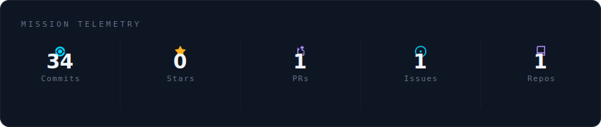

<!-- Galaxy Profile README Template
     Customize this file with your own info, then rename it to README.md
     in your GitHub profile repo (github.com/YOUR_USERNAME/YOUR_USERNAME).
     The SVG paths below point to assets/generated/ which are auto-generated
     by the GitHub Actions workflow or by running: python -m generator.main -->

<div align="center">
  <a href="#">
     
  </a>
</div>

<br/>

<div align="center">
  <a href="#">
     
  </a>
</div>

<br/>

<div align="center">
  <a href="#">
     
  </a>
</div>

<br/>

<div align="center">
  <a href="#">
     
  </a>
</div>

<br/>

<div align="center">
  <a href="#">
     
  </a>
</div>

<br/>

<div align="center">
  <a href="#">
    
  </a>
</div>

<br/>


<div align="center">
  <!-- Rainbow divider -->
  
</div>

<h2 align="center"> 
  GitHub Streak
</h2>

<table align="center">
  <tr>
    <td>
       <picture>
         <source media="(prefers-color-scheme: dark)" srcset="https://raw.githubusercontent.com/developer-labibur/developer-labibur/output/snake.svg">
           
       </picture>
    </td>
  </tr>
</table>

<h2 align="center"> 
  GitHub Streak
</h2>

<table>
  <tr>
    <td width="50%">
      <h3 align="center">Deep Quran</h3>
      <p align="center">
        <strong>Role:</strong> Game & Quran Module Owner
      </p>
      <p align="center">
        <a href="https://play.google.com/store/apps/details?id=com.deepquran.app" target="_blank">
          
        </a>
        <a href="https://apps.apple.com/us/app/deep-quran/id6756174229" target="_blank">
          
        </a>
      </p>
      <p align="center">
        Islamic learning platform featuring audio recitation, translations, and optimized reading experience with focus on performance and accessibility.
      </p>
    </td>
    <td width="50%">
      <h3 align="center">Go Get A Genie</h3>
      <p align="center">
        <strong>Role:</strong> Sole Flutter Developer
      </p>
      <p align="center">
        <a href="https://play.google.com/store/apps/details?id=com.gogetagenie.app" target="_blank">
          
        </a>
      </p>
      <p align="center">
        AI-powered project and task management app with manual/AI project creation, collaboration, infinite subtasks, and real-time notifications for streamlined workflow.
      </p>
    </td>
  </tr>
</table>

<br/>

<details>
<summary>
   <table align="center">
     <tr>
       <td>
           <strong>👇 Click to Expand My Profile 👇</strong>
       </td>
     </tr>
   </table>
</summary>   

<br/>

<!-- Header with animated gradient and 3D effect -->
<p align="center">
  <!-- Rainbow divider -->
  
  <br/><br/>
     
  <a href="#">
    
  </a>
</p>

<!-- Visitor counter with snake animation -->
<p align="center">
  
  
</p>

<p align="center" style="font-size: 18px;">
  Flutter Developer with proven expertise in building production-ready mobile applications for Google Play Store and Apple App Store.  
  Specialized in real-time communication, AI integration, and scalable cross-platform solutions.
</p>

<h2 align="center"> 
  Portfolio
</h2>

<p align="center">
  <a href="https://devlabib.web.app" target="_blank">
    
  </a>
</p>

<p align="center">
  Explore my portfolio of scalable mobile apps, clean architectures, and AI-powered solutions.
</p>

<h2 align="center"> 
  About Me
</h2>

```yaml
Current Role: Flutter Developer @ Softvence | Dhaka, Bangladesh
Experience: Delivered 2+ published apps on Play Store & App Store
Specialization: Flutter, Real-time Communication (Agora), AI Integration, Payment Systems
Education: BSc in Computer Science and Engineering, Uttara University (Ongoing)
Philosophy: Building scalable, user-centric apps with clean architecture
```

<h2 align="center"> 
  Core Technologies
</h2>

<p align="center">
  
  
  
  
  
  
  
  
  
  
  
  
  

  
</p>

<a href="#">
  
</a>


<p align="center">
  <br/>
  <i>My previous GitHub account was unexpectedly suspended. This is my new account where I am actively rebuilding and showcasing my work.</i>
</p>

</details>

<br/>

<div align="center">
  <a href="https://cdn.jsdelivr.net/gh/developer-labibur/personal-profile/Resume-of-Labibur-Apr21.pdf" target="_blank">
    
  </a>
     
  <a href="https://www.linkedin.com/in/labib-ur-rahman/">
    
  </a>
  
  <a href="mailto:labibur@softvence.com">
    
  </a>

  <a href="https://www.facebook.com/developer-labib/" target="_blank">
    
  </a>
</div>
